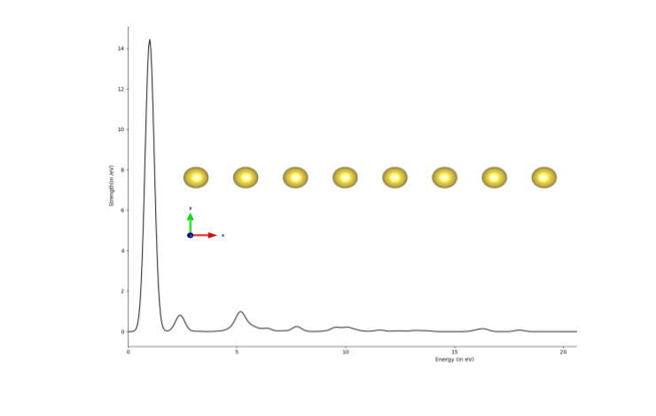
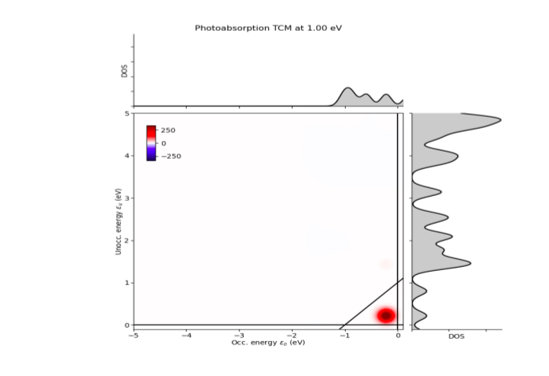
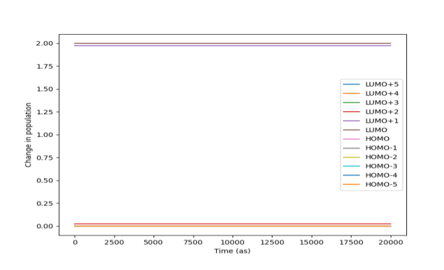

TDDFT calculations using GPAW
==================================
TDDFT calculations are performed usin GPAW inplemented in LITESOPH.

Results for Na8 Chain using GUI for GPAW Engine
--------------------------------------------------
For the molecular system Na8 chain, the following results are obtained using LITESOPH-GUI.

Spectrum Analysis
####################
The Oscillator strength (/eV) with Energy (eV) is shown bellow:

Transition Contribution Map (TCM)
#####################################
It can be visualized the photoabsorption decomposition as a TCM. The photoabsorption TCM of Na8 at 1.00 eV is shown bellow:

Population Evolution
#########################
The change in population with time for Na8 chain is shown bellow:

