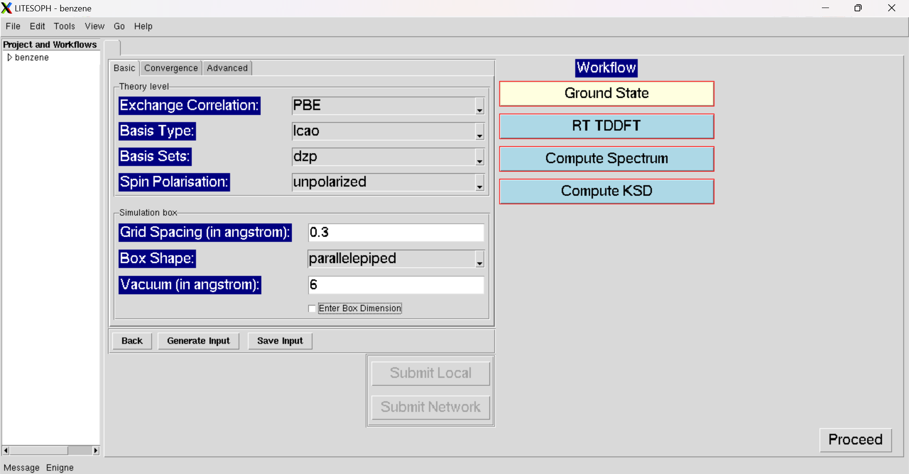
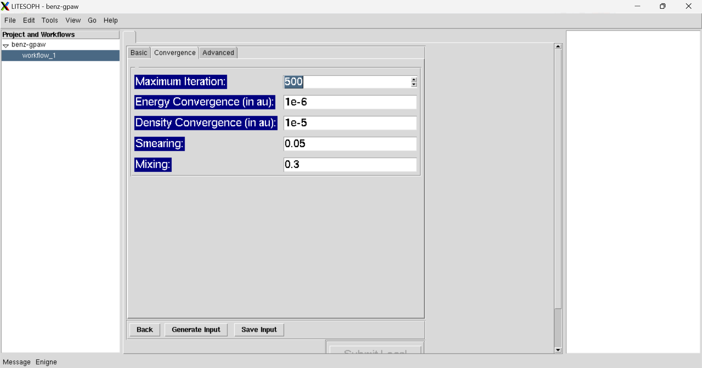
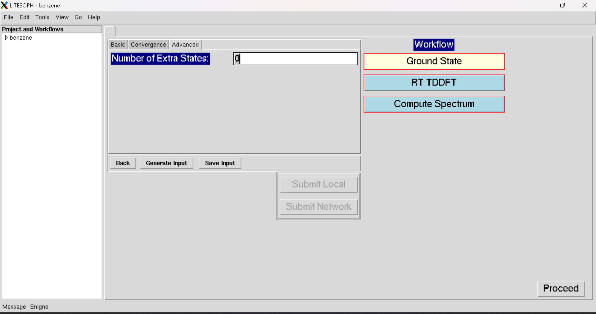

.. _KSD GS:

Ground State
===============
For Ground State Calculations, there are three sections: (1) :ref:`Basic <basic>`, (2) :ref:`Convergence <convergence>` and :ref:`Advanced <advanced>` for input parameters.

.. _basic:

Basic
############
It includes the basic input parameters.

.. _convergence:

Convergence
###########
It includes the input parameters for convergence.

.. _advanced:

Advanced
##############
It includes some advanced input parameters.

* :ref:`Proceed <rt-tddft>` : Open the Workflow for RT-TDDFT Calculations.