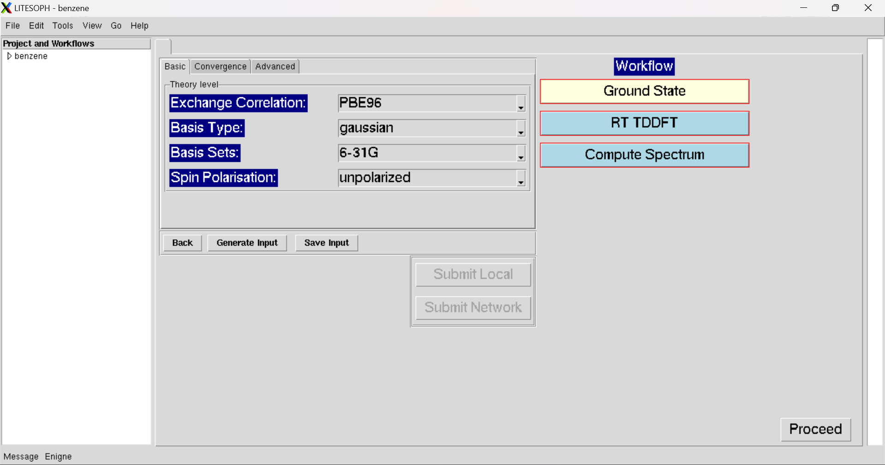

.. _GS:

Ground State
===============
For Ground State Calculations, there are three windows for input parameters.

Basic
############
This are the basic input parameters to calculate GS-DFT Calculations.

Convergence
###########
This are the convergence parameters.

.. image:: ./convergence.png
   :width: 800
   :alt: Spectrum

Advanced
##############
It is used for some advanced Calculations.

.. image:: ./advanced.png
   :width: 800
   :alt: Spectrum

* :ref:`Proceed <rt-tddft>` : Open the Workflow for RT-TDDFT Calculations.