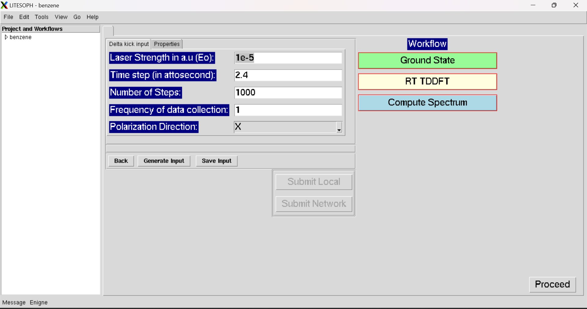
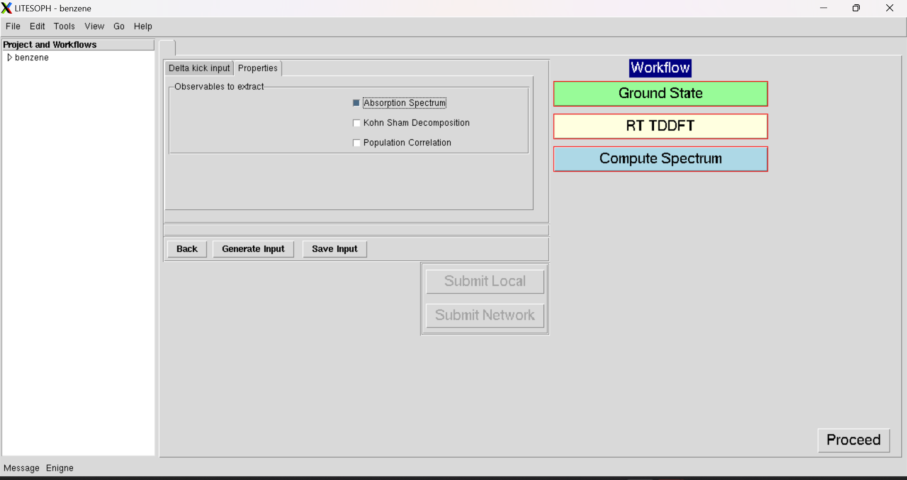

.. _rt-tddft:

RT-TDDFT
==========
The RT-TDDFT calculations can be done as follows:

.. _delta kick:

Delta kick Inputs
###################

Properties
#################

* :ref:`Proceed <compute spectrum>` : Open the Workflow for Compute Spectrum Calculations.