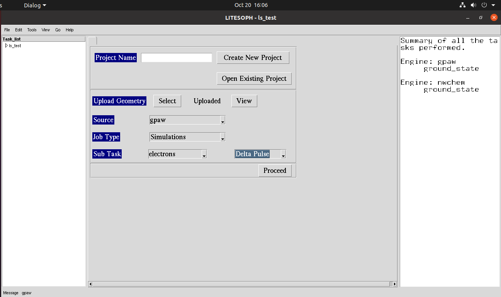
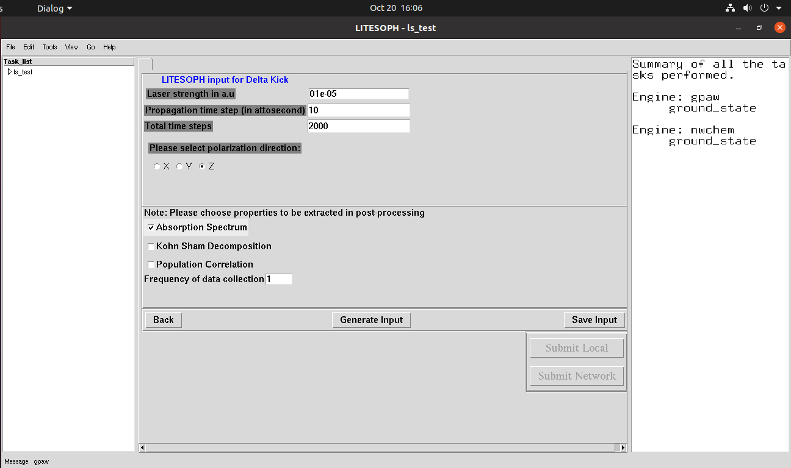
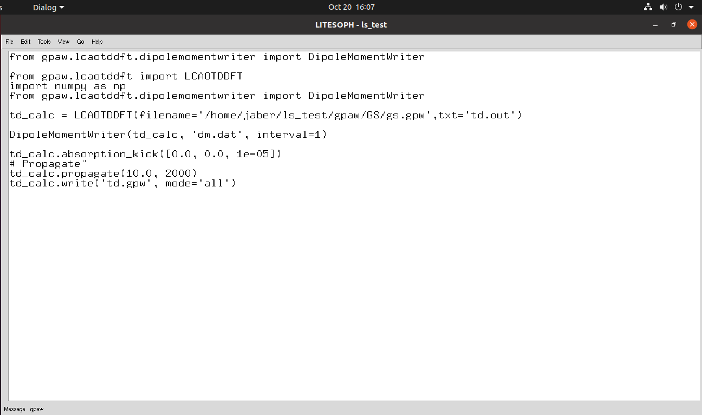

.. _TDDFT:

TDDFT Calculation
===================

After GS calculations, Proceed to the TDDFT calculations.

Absorption Spectrum, Kohn-Sham Decomposition or Population Correlations
---------------------------------------------------------------------------

Gpaw Input file with delta pulse:

