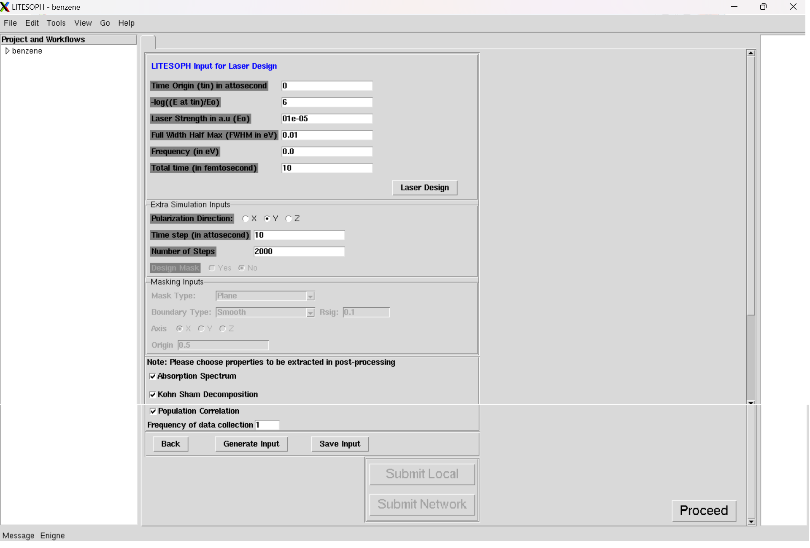

.. _GP:

Goussian Pulse
====================

It contains three sections: (1) :ref:`LITESOPH Input for LASER Design <laser design>`, (2) :ref:`Extra Simulation Inputs <Simulation Input>` and (3) :ref:`Masking Inputs <masking inputs>`.

.. _laser design:

LITESOPH Input for LASER Design
-----------------------------------

    * **Time Origin** (`t_{in}`) **in attosecond**: *Give the innitial time.* (**Default is 0**)

    * **-log** (**E in** `\frac{t_{in}}{E_0}`): *Enter this input.* (**Default is 6**)

    * **LASER Strength in a.u** (`E_0`): *Give this input.* (**Default is** `01e^{-05}`)

    * **Full Width Half Max (FWHM in eV)**: *Give FWHM .* (**Default is 0.01**)

    * **Frequency in (eV)**: *Enter the Frequency.* **(Default is 0.0.)**

    * **Total Time (in femtosecond)**: *Give the Total time.* **(Default is 10.)**

.. _Simulation Input:

Extra Simulation Inputs
-----------------------
    * **Poloarization Direction** : *You can choose* **X** , **Y** *and* **Z** *axis*.(**Default is X** )

    * **Time Step (in as)**: *Give the Time Step.* (**Default is 10**) 

    * **Number of Steps**: *Give the Number of Steps.* (**Default is 1000**)

.. _masking inputs:

