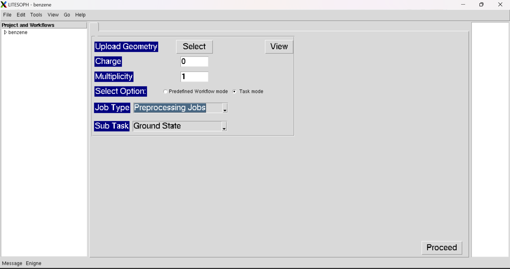

.. _task mode:

Task Mode
===============
In Task Mode, the GUI looks like the following window:

In Task Mode, there are two defferent widgets for input parameters: (1) :ref:`Job_type <job type>` and (2) :ref:`Sub_Task `.

.. toctree::
   :maxdepth: 10

   Job_type/Job_type
   

* :ref:`Proceed <KSD GS>` : Open the Workflow for Ground State Calculations.